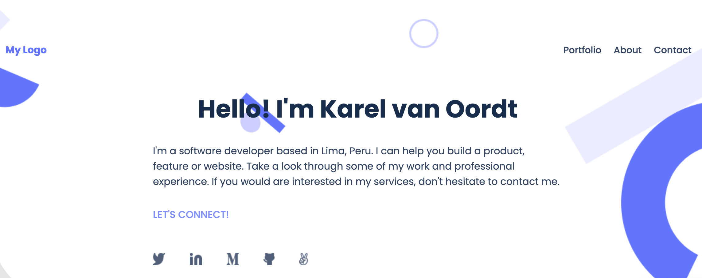

# Personal Portfolio (Desktop & Mobile Responsive version)

As a part of Microvers's Module 1, I've added html element using javascript for the pop-up modal page of my Personal Portfolio. 

## Built With

- HTML
- CSS
- NodeJS
- JavaScript

## Live Demo

[Live Demo Link](https://karelvanoordt.github.io/Personal-Portfolio/)

## Getting Started

To get a local copy up and running follow these simple example steps.

Download the files or clone them and use them in your local environment. Also you can fork the repository and continue where you want to.

### Prerequisites

- Have a web browser installed

## Authors

👤 **Karel van Oordt**

- GitHub: [@karelvanoordt](https://github.com/karelvanoordt)
- Twitter: [@karelvanoordtEN](https://twitter.com/karelvanoordtEN)
- LinkedIn: [LinkedIn](https://linkedin.com/in/karelvanoordt)

## 🤝 Contributing

Contributions, issues, and feature requests are welcome!

Feel free to check the [issues page](../../issues/).

## Show your support

Give a ⭐️ if you like this project!

## Acknowledgments

- Thank to everyone in my programming, standup and morning team.

## 📝 License

This project is [MIT](./MIT.md) licensed.
